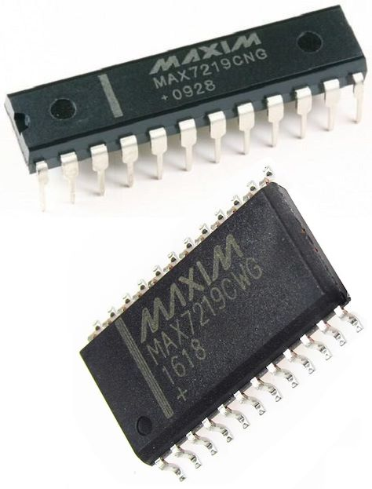

# Maxim MAX7219 8-Digit LED Display Driver for Arduino

I made this display driver for 2 reasons: 
- I not found a proper good driver for interfacing with this chip driver on Arduino
- To practice my C programming

This driver uses the proper `SPI` from ATMEGA chip, NOT the emulated version using `shiftout()`

This driver was tested on ATMEGA328P (Arduino Uno)

Dependecies:
- <Arduino.h>
- <SPI.h>

Example code included in how to use this driver
